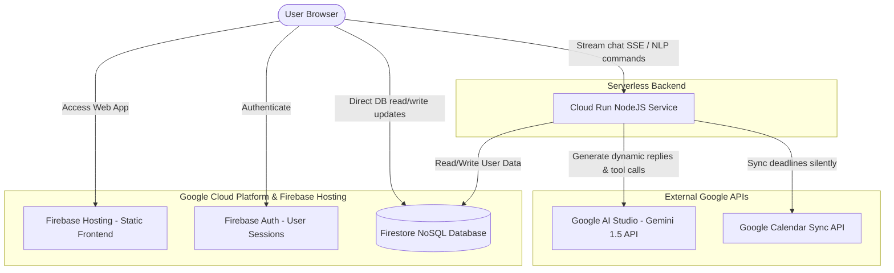

# ⚡ Deadline Guardian AI

> **Never miss a deadline again.** Your autonomous AI productivity agent — powered by Gemini 1.5 Flash.

🏆 **Built for Google Hackathon 2026** | [🌐 Live Demo](https://deadline-guardian-ai-3965b.web.app)

---

## 🔑 JUDGES QUICK-START GUIDE
To review this project without undergoing Google Account verification warnings or restricted test-user blocks:

1. Open the **[Live Demo Website](https://deadline-guardian-ai-3965b.web.app)**
2. Click **"Get Started"** or **"Launch App"** to navigate to the Login screen.
3. Scroll to the bottom of the login card under **"Developer Tools"**.
4. Click the **`Bypass with Dev Account`** button.
5. **Boom! In exactly 1-click**, you are instantly authenticated into a pre-configured profile containing active mock tasks, habits, and progress.

---

## 🎯 The Problem

- **87%** of students miss at least one critical deadline per semester.
- Professionals lose **2.1 hours/week** to deadline anxiety and reactive scrambling.
- **73%** say reminder apps fail them — they remind but never **help**.

**Existing tools are reactive. Deadline Guardian AI is autonomous.**

| Before | After |
|---|---|
| "I forgot my report was due tonight. All-nighter, lost 20%." | "AI noticed I was overloaded 3 days early, rescheduled tasks, blocked 4 hours. Submitted 6 hours early." |

---

## ✨ What Makes This Different

| Feature | Why It Matters |
|---|---|
| 🧠 **Gemini 1.5 Flash** with 20 function-calling tools | Real autonomous agent — not just a chatbot |
| 📷 **Gemini Vision Photo Scanner** | Photograph a handwritten list → AI extracts all tasks |
| ✅ **Approve/Reject action flow** | Agent proposes changes, you decide — transparent autonomy |
| 🔮 **Deadline Time Travel** | Simulate 3 futures: current pace, AI-optimized, maximum effort |
| 😰 **Emotional Intelligence** | Detects stress → adapts tone and reduces cognitive load |
| 📅 **Silent Google Calendar sync** | Task created → calendar event appears instantly, no redirect |
| 🎙 **Voice in + Voice out** | Speak tasks, hear AI responses |
| 🏗 **Dual-Mode Adapter** | Works fully with OR without Firebase/Gemini keys |
| 🔥 **Gamification** | XP, levels, 25 badges, streaks, leaderboard |
| ⏱ **Focus Mode** | Pomodoro with ambient sounds + XP rewards |

---

## 🏗 System Architecture



---

## 🏗 Google Technologies Used

| Service | How It's Used |
|---|---|
| **Gemini 1.5 Flash** | AI agent brain — NLP parsing, risk scoring, planning, 20 function-calling tools |
| **Gemini 1.5 Flash Vision** | Multimodal photo → task extraction from handwritten lists |
| **Firebase Authentication** | Google Sign-In + Email/Password auth |
| **Firebase Firestore** | Primary real-time database for all user data |
| **Firebase Storage** | File attachments on tasks |
| **Firebase App Check** | Abuse prevention and security |
| **Firebase Cloud Messaging** | Browser push notifications for deadline alerts |
| **Google Cloud Run** | Containerized backend deployment |
| **Cloud Build** | CI/CD pipeline — auto-deploy on git push |
| **Artifact Registry** | Docker image storage |
| **Secret Manager** | Secure storage for Gemini API key and Firebase credentials |
| **Cloud Logging** | Structured application logs |
| **Cloud Monitoring** | Uptime alerts and performance dashboards |
| **Google Calendar API** | Silent sync — tasks auto-appear as calendar events |
| **Google Sign-In** | OAuth 2.0 authentication with calendar permission scoping |

---

## 🛠 Tech Stack

**Frontend:** React 18 + TypeScript + Vite + Tailwind CSS + Framer Motion  
**Backend:** Node.js + Express + TypeScript  
**Database:** Firebase Firestore + in-memory fallback  
**AI:** Gemini 1.5 Flash (function calling + vision + streaming SSE)  
**Deployment:** Docker + Google Cloud Run + Firebase Hosting  

---

## 🚀 Quick Start

```bash
# Clone
git clone https://github.com/KEERTHIG04/deadline-guardian-ai
cd deadline-guardian-ai

# Frontend
cd frontend
cp .env.example .env.local
# Fill in your Firebase and backend URL
npm install && npm run dev

# Backend (new terminal)
cd backend
cp .env.example .env.local
# Fill in Gemini API key and Firebase credentials
npm install && npm run dev
```

---

## 🤖 AI Agent — 20 Function-Calling Tools

```
create_task          complete_task        delete_task
update_task          reschedule_task      bulk_reschedule
get_overdue_tasks    get_tasks_due_today  detect_conflicts
generate_daily_plan  generate_weekly_plan compute_all_risks
generate_rescue_plan generate_subtasks    generate_time_travel
estimate_duration    send_notification    add_to_google_calendar
create_project       compute_deadline_risk
```

---

## 📁 Directory Structure

```
deadline-guardian-ai/
├── frontend/               # React + TypeScript + Vite
│   └── src/
│       ├── components/     # UI components (PhotoScanner, AgentActions, TimeTravelModal...)
│       ├── pages/          # 15 pages (Dashboard, Tasks, AI Agent, Analytics...)
│       ├── services/       # sentiment.service.ts, API helpers
│       ├── stores/         # Zustand state (tasks, auth, agent, projects)
│       └── hooks/          # useKeyboardShortcuts
├── backend/                # Node.js + Express + TypeScript
│   └── src/
│       ├── services/ai/    # geminiService.ts, toolHandlers.ts, agentTools.ts
│       └── repositories/  # db.ts (Firestore + in-memory dual-mode)
├── firestore.rules         # Strict user-scoped security rules
├── firebase.json           # Firebase Hosting config
├── Dockerfile              # Backend container
├── docker-compose.yml
└── cloudbuild.yaml         # GCP CI/CD pipeline
```

---

Built with ❤️ for Google Hackathon 2026
